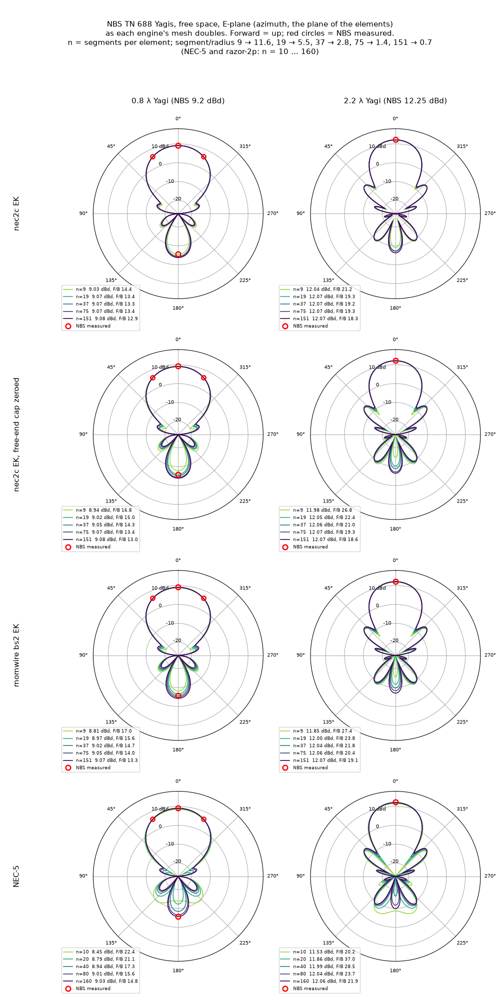

# Verdict: NBS TN 688 Yagis, measured gain on four engines

**Suggested by:** Dr David Kirkby, on the antenna-research groups.io list
(2026-10-07), as a *measured* reference for this collection. Every other
case here compares engines with each other; this one compares them with a
range measurement. **Status:** verdict published 2026-10-08.

## The antennas

These are the six "optimized" Yagi-Uda designs in Table 1 of NBS Technical
Note 688 (P. P. Viezbicke, *Yagi Antenna Design*, 1976). NBS built them as
400 MHz scale models and measured each one's forward gain against a
half-wave dipole at the same height.

| design (boom) | elements | director spacing | reflector | NBS gain |
| --- | --- | --- | --- | --- |
| 0.4 λ | 3 | 0.20 λ | 0.482 λ | 7.1 dBd |
| 0.8 λ | 5 | 0.20 λ | 0.482 λ | 9.2 dBd |
| 1.2 λ | 6 | 0.25 λ | 0.482 λ | 10.2 dBd |
| 2.2 λ | 12 | 0.20 λ | 0.482 λ | 12.25 dBd |
| 3.2 λ | 17 | 0.20 λ | 0.482 λ | 13.4 dBd |
| 4.2 λ | 15 | 0.308 λ | 0.475 λ | 14.2 dBd |

The director lengths are Table 1's, transcribed twice independently; the
two transcriptions agree on all 58 elements, and both were checked against
the page image again for this run. Every element has d/λ = 0.0085
(0.63 cm aluminium at 400 MHz). The reflector sits 0.2 λ behind the driven
element. Director k sits at k·S. The boom is non-conducting plexiglass, so
it is not modelled.

NBS states its accuracy as **±0.5 dB**, with 0.2 dB repeatability. Gain is
quoted in the forward direction against a dipole at the same height. The
antennas sat 3 λ above ground (Fig 1 draws 2 λ) on a range about 320 m
long, illuminated at grazing angles.

## The decks

`nbs688_<L>lambda.nec` in this directory: NEC-2 dialect, free space, at
400 MHz. Elements run straight along y, the boom along +x, and forward is
+x (θ = 90°, φ = 0°). Element radius is 0.0085 λ / 2 = 3.185 mm. Every
element has 9 segments at ×1, which is 9.3 to 11.6 segments per half
wave. An `EX 0` voltage source sits on the driven element's centre
segment. RP cards ask for forward and back, a 0.5° azimuth (E-plane) cut,
and a 0.5° elevation (H-plane) cut through forward.

**The driven element is an assumption.** NBS used a λ/2 *folded* dipole
and did not tabulate its length. Each deck models it as a straight dipole,
trimmed so the feedpoint reactance is zero at 400 MHz with the parasitics
present. The trim was done on momwire bs2 at ×5 and then frozen for every
engine and every rung:

| design | 0.4 | 0.8 | 1.2 | 2.2 | 3.2 | 4.2 |
| --- | --- | --- | --- | --- | --- | --- |
| driven length (λ) | 0.44913 | 0.44445 | 0.44411 | 0.44459 | 0.44409 | 0.43874 |
| bs2 ×5 Z (Ω) | 21.0 | 16.9 | 15.6 | 20.2 | 28.7 | 23.8 |

The reference dipole for the ground check is trimmed the same way, alone:
0.46333 λ, 73.1 Ω.

## The ladder

Every GW's segment count is multiplied by m, and the EX segment is
re-centred to (s−1)·m + (m+1)/2. The rungs are ×1, ×3, ×5, ×7 and ×9, which
gives 9, 27, 45, 63 and 81 segments per element. NEC-5 needs an even count
on the fed wire (its source sits at a knot), so its driven element runs
10, 28, 46, 64, 82. Its other elements are unchanged.

**One mesh caveat applies to this whole study.** These are fat elements.
Segment length over radius (Δ/a) runs as follows:

| rung | ×1 | ×3 | ×5 | ×7 | ×9 |
| --- | --- | --- | --- | --- | --- |
| Δ/a | 10–13 | 3.4–4.2 | 2.0–2.5 | 1.4–1.8 | 1.1–1.4 |

From ×5 up, the fine rungs are below the range where NEC-2's reduced
thin-wire kernel is trustworthy. This shows in the impedance, not the gain.
nec2c's and bs2's reactance climbs at every rung past ×3, and NEC-4.2's
falls. Forward gain barely notices. An `EK` (extended kernel) re-run of
nec2c and bs2 is reported below as the kernel check.

### Forward gain, dBi, deck as written (no EK)

"Converged" is the Richardson extrapolation over ×5/×7/×9 where that
triple is monotone with shrinking steps and a fitted order of 0.5–4.
Otherwise it is the ×9 value, and the table says so.

| design | engine | ×1 | ×3 | ×5 | ×7 | ×9 | converged |
| --- | --- | --- | --- | --- | --- | --- | --- |
| 0.4 | nec2c | 8.943 | 9.042 | 9.065 | 9.083 | 9.096 | 9.096 (×9, not monotone) |
| | NEC-4.2 | 8.940 | 9.006 | 8.984 | 8.970 | 8.964 | 8.959 (p 2.5) |
| | momwire bs2 | 8.734 | 8.946 | 9.001 | 9.032 | 9.054 | 9.054 (×9, creeping, p 0.2) |
| | NEC-5 | 8.435 | 8.776 | 8.847 | 8.880 | 8.899 | 8.981 (p 0.8) |
| 0.8 | nec2c | 11.184 | 11.231 | 11.232 | 11.229 | 11.225 | 11.225 (×9) |
| | NEC-4.2 | 11.182 | 11.224 | 11.216 | 11.209 | 11.207 | 11.202 (p 2.0) |
| | momwire bs2 | 10.990 | 11.184 | 11.214 | 11.224 | 11.226 | 11.228 (p 3.6) |
| | NEC-5 | 10.510 | 11.020 | 11.106 | 11.141 | 11.158 | 11.197 (p 1.4) |
| 1.2 | nec2c | 12.373 | 12.440 | 12.439 | 12.431 | 12.421 | 12.421 (×9) |
| | NEC-4.2 | 12.368 | 12.428 | 12.413 | 12.400 | 12.394 | 12.386 (p 1.9) |
| | momwire bs2 | 12.121 | 12.373 | 12.419 | 12.432 | 12.434 | 12.434 (×9) |
| | NEC-5 | 11.479 | 12.089 | 12.221 | 12.277 | 12.307 | 12.402 (p 1.1) |
| 2.2 | nec2c | 14.195 | 14.208 | 14.198 | 14.187 | 14.177 | 14.177 (×9) |
| | NEC-4.2 | 14.194 | 14.216 | 14.218 | 14.217 | 14.216 | 14.215 (p 1.1) |
| | momwire bs2 | 14.025 | 14.191 | 14.204 | 14.201 | 14.194 | 14.194 (×9) |
| | NEC-5 | 13.584 | 14.084 | 14.155 | 14.179 | 14.190 | 14.213 (p 1.6) |
| 3.2 | nec2c | 15.322 | 15.312 | 15.296 | 15.281 | 15.267 | 15.267 (×9) |
| | NEC-4.2 | 15.324 | 15.332 | 15.341 | 15.345 | 15.346 | 15.347 (p 3.0) |
| | momwire bs2 | 15.184 | 15.317 | 15.316 | 15.305 | 15.292 | 15.292 (×9) |
| | NEC-5 | 14.830 | 15.277 | 15.323 | 15.338 | 15.342 | 15.347 (p 2.8) |
| 4.2 | nec2c | 16.071 | 16.091 | 16.079 | 16.065 | 16.051 | 16.051 (×9) |
| | NEC-4.2 | 16.070 | 16.099 | 16.098 | 16.094 | 16.092 | 16.089 (p 1.8) |
| | momwire bs2 | 15.867 | 16.068 | 16.087 | 16.084 | 16.075 | 16.075 (×9) |
| | NEC-5 | 15.006 | 15.860 | 15.980 | 16.023 | 16.044 | 16.095 (p 1.4) |

NEC-5 starts low at the coarse rungs (−0.5 to −1.1 dB at ×1). It then
climbs monotonically into the others, the same first-order approach its
impedance ladders show in the earlier verdicts.
nec2c and bs2 turn over past ×3 on the long designs. That turn is the
reduced kernel (see the EK check below), not slow convergence.

The reference dipole reads 2.13–2.14 dBi on every engine, with nec2c
2.141, NEC-4.2 2.134, bs2 2.141 and NEC-5 2.131. So "dBi − 2.15" and
"dBi − this engine's own dipole" differ by at most 0.02 dB.

## The verdict

### Measured vs modelled gain, dBd (free-space dBi − 2.15)

| design | NBS | nec2c | NEC-4.2 | momwire bs2 | NEC-5 | engine spread | mean − NBS |
| --- | --- | --- | --- | --- | --- | --- | --- |
| 0.4 λ | 7.1 | 6.95 (−0.15) | 6.81 (−0.29) | 6.90 (−0.20) | 6.83 (−0.27) | 0.14 | **−0.23** |
| 0.8 λ | 9.2 | 9.08 (−0.12) | 9.05 (−0.15) | 9.08 (−0.12) | 9.05 (−0.15) | 0.03 | **−0.14** |
| 1.2 λ | 10.2 | 10.27 (+0.07) | 10.24 (+0.04) | 10.28 (+0.08) | 10.25 (+0.05) | 0.05 | **+0.06** |
| 2.2 λ | 12.25 | 12.03 (−0.22) | 12.06 (−0.19) | 12.04 (−0.21) | 12.06 (−0.19) | 0.04 | **−0.20** |
| 3.2 λ | 13.4 | 13.12 (−0.28) | 13.20 (−0.20) | 13.14 (−0.26) | 13.20 (−0.20) | 0.08 | **−0.24** |
| 4.2 λ | 14.2 | 13.90 (−0.30) | 13.94 (−0.26) | 13.93 (−0.27) | 13.94 (−0.26) | 0.04 | **−0.27** |

NBS's band is ±0.5 dB. **Every engine on every design sits inside it.**
The largest single miss is −0.30 dB (nec2c, 4.2 λ).

**Kernel check (EK on nec2c and bs2).** With the extended kernel, nec2c's
and bs2's reactance stops running away. Their gains then join NEC-4.2's
and NEC-5's. At ×9 (NEC-5 Richardson in brackets), in dBd:

| design | nec2c EK | NEC-4.2 | bs2 EK | NEC-5 | spread |
| --- | --- | --- | --- | --- | --- |
| 0.4 | 6.85 | 6.81 | 6.82 | 6.75 (6.83) | 0.04 |
| 0.8 | 9.07 | 9.06 | 9.06 | 9.01 (9.05) | 0.02 |
| 1.2 | 10.27 | 10.24 | 10.25 | 10.16 (10.25) | 0.03 |
| 2.2 | 12.07 | 12.07 | 12.06 | 12.04 (12.06) | 0.01 |
| 3.2 | 13.19 | 13.20 | 13.19 | 13.19 (13.20) | 0.01 |
| 4.2 | 13.95 | 13.94 | 13.94 | 13.89 (13.95) | 0.02 |

Kernel-matched, the four engines agree on forward gain to within
**0.034 dB** on every design (0.008 dB on 2.2 λ and 3.2 λ) (spread computed with NEC-5's extrapolated
value). The as-written spread of up to 0.14 dB is the reduced kernel on
nec2c and bs2 at Δ/a < 2.5, and it does not change any call.

### The call

1. **The four engines agree with each other.** Forward gain agrees to
   within 0.034 dB kernel-matched, and to within 0.14 dB on the decks as
   written. NEC-2, NEC-4.2, NEC-5 and momwire give the same answer for
   these antennas.
2. **They agree with NBS to within its stated ±0.5 dB, on all six.**
3. **But they sit consistently below NBS.** Five of the six designs model
   low, by 0.14 to 0.27 dB (engine mean). The sixth, 1.2 λ, models
   0.06 dB high. Across the six, the mean offset is **−0.17 dB**. It is
   largest on the long booms (−0.24 dB at 3.2 λ, −0.27 dB at 4.2 λ), but
   it does not grow steadily with length: 0.4 λ reads −0.23 dB and 1.2 λ
   reads +0.06 dB. The offset is inside NBS's ±0.5 dB and below its 0.2 dB
   repeatability on most designs, so it is not evidence that the
   measurements are wrong. We report the pattern as measured. Nothing was
   tuned to close it. Candidate causes we did *not* model: the plexiglass
   boom and the element mounting (a dielectric loads the elements and
   makes them electrically longer), the folded driven element (but see
   below, it does not matter), d/λ (0.63 cm / 74.95 cm is 0.0084, not
   0.0085), and NBS's 2.16 dB isotropic offset.
4. **Front-to-back converges slowly, and to one place.** On the ×1–×9
   ladder F/B looked unconverged and the engines disagreed. A doubling
   ladder shows why: NEC-2's free-end cap, Galerkin against point-matched
   testing, and kernel breakdown once segments are shorter than about 1.5
   radii. Where the engines meet, the 0.8 λ design reads 13.4–14.0 dB
   against NBS's 15 dB. See *F/B: a doubling ladder* below.

## Ground vs free space

NBS measured each Yagi against a dipole at the same height over real
ground, illuminated at grazing angles. We modelled that directly on
momwire bs2 and NEC-4.2 at ×5. Each Yagi and the reference dipole stand
at 2 λ and at 3 λ over Sommerfeld ground (ε_r = 13, σ = 0.005 S/m,
"average"), and we compare their gains in the forward direction at the
same elevation.

At grazing elevation (0.25°–2°), the Yagi-minus-dipole ratio equals the
free-space dBd **to within 0.06 dB** on every design, both heights and both
engines. Grazing − free space ran from −0.055 to +0.057 dB. The free-space
comparison above is therefore the right comparison, and the 2 λ / 3 λ
conflict between NBS's text and its Fig 1 does not matter at grazing.

The ratio falls as elevation rises, because the long Yagis' narrow H-plane
beam weights the ground-reflected ray less than the dipole's does.

| design | grazing (≤ 2°), 3 λ | at 5°, 3 λ | lobe peak vs dipole peak, 3 λ | lobe peak vs dipole peak, 2 λ |
| --- | --- | --- | --- | --- |
| 0.4 λ | −0.05 / +0.02 | −0.08 / −0.02 | −0.08 / −0.02 | −0.12 / −0.06 |
| 0.8 λ | +0.02 / +0.03 | −0.06 / −0.05 | −0.05 / −0.04 | −0.13 / −0.12 |
| 1.2 λ | −0.01 / +0.02 | −0.13 / −0.10 | −0.12 / −0.09 | −0.25 / −0.21 |
| 2.2 λ | +0.03 / +0.01 | −0.14 / −0.17 | −0.13 / −0.15 | −0.30 / −0.31 |
| 3.2 λ | +0.05 / +0.00 | −0.20 / −0.24 | −0.17 / −0.22 | −0.45 / −0.48 |
| 4.2 λ | +0.03 / +0.01 | −0.27 / −0.28 | −0.23 / −0.25 | −0.52 / −0.52 |

Each cell is bs2 / NEC-4.2, in dB, relative to that engine's own
free-space dBd (Yagi minus its own reference dipole). The ground runs are
at ×5 and the free-space values are converged, so the bs2 0.4 λ cells
carry its ×5-to-×9 creep, about 0.05 dB. So if NBS's range had put the antennas in the first lobe rather
than at grazing, the measured numbers should have come out *lower* than
free space, not higher. Ground does not explain the −0.2 dB offset. If
anything, it widens it.

## Driven-element sensitivity

With every engine at ×5, we changed the straight driven element's length
by ±1 %. Forward gain moved by **at most 0.002 dB**, on every design and
every engine. F/B moved by at most 0.13 dB. The feedpoint moved by about
±6 Ω of reactance, as expected.

**Folded check (0.8 λ design).** We replaced the straight driven element
with a folded dipole: two 0.4341 λ conductors 0.01 λ apart in z, joined at
the ends, and trimmed for X = 0 on bs2 at ×3. Its feed resistance reads
65–73 Ω on nec2c, NEC-4.2 and bs2, as a folded dipole should, against
17 Ω straight. NEC-5 reads 73 − j25 Ω at ×5: the conductors are only
0.0015 λ apart surface to surface, and the folded element was trimmed on
bs2, not on NEC-5. Forward gain at ×5 changed by
**−0.005 to −0.008 dB** on all four engines. NBS's folded-versus-straight
choice cannot matter at ±0.5 dB.

## The 0.4 λ director: 0.424 or 0.443?

Table 1 prints the 0.4 λ design's single director as 0.424 λ. Fig 9's
curve A reads about 0.443 λ at d/λ = 0.0085. We ran the full ladder with
each, and then swept the director from 0.410 to 0.460 λ on all four
engines at ×5 and ×9.

| | D1 = 0.424 (Table 1) | D1 = 0.443 (Fig 9) | NBS |
| --- | --- | --- | --- |
| forward gain, dBd (four engines) | 6.81 – 6.95 | 7.48 – 7.53 | 7.1 |
| F/B, ×9 | 14.1 – 15.8 dB | 7.6 – 9.3 dB | "only 8 dB down" (Fig 14) |
| E-plane −3 dB beamwidth, ×9 | 59.2° – 60.3° | 53.5° – 55.1° | 57° |
| H-plane −3 dB beamwidth, ×9 | 85.7° – 88.6° | 70.4° – 74.0° | 72° |
| director length for maximum gain (sweep) | — | — | 0.4425 – 0.4475 λ at ×9 on every engine (0.4425 – 0.450 at ×5) |

**Gain alone cannot separate them.** Both versions sit inside ±0.5 dB:
0.424 reads 0.15–0.29 dB below NBS and 0.443 reads 0.38–0.43 dB above.
Read on gain alone, 0.424 is the closer of the two.

**Everything else points to 0.443:**

- Table 1 is titled "optimized lengths". On all four engines the
  gain-maximising director for this geometry is 0.4425–0.4475 λ. At 0.424
  the gain is 0.55–0.8 dB below that optimum, depending on the engine, on
  a slope of about 0.045 dB per 0.001 λ.
- The text's pattern figures for the "3-element, 0.4 λ" Yagi (Fig 14)
  match 0.443 and do not match 0.424: rear only 8 dB down, and E/H
  beamwidths of 57°/72°. The H-plane beamwidth alone separates them by
  15°.

Our reading is that 0.443 is what NBS built and measured, and that Table
1's 0.424 is a misprint. One caveat: the report does not say outright that
Fig 14's antenna is the Table 1 design. If it is 0.443, the 0.4 λ
measurement sits 0.4 dB *below* the models. That is the opposite sign from
the other five designs, and still inside ±0.5 dB. The headline tables
above use Table 1's 0.424, as printed.

## F/B and beamwidths

### −3 dB beamwidths

Ranges are across the four engines at ×9, decks as written.

| design | E-plane (azimuth) | H-plane (elevation) | NBS (text) |
| --- | --- | --- | --- |
| 0.4 λ | 59.2° – 60.3° | 85.7° – 88.6° | 57° / 72° (see the director section above) |
| 0.8 λ | 46.6° – 48.4° | 55.8° – 58.9° | **48° / 56°** |
| 1.2 λ | 40.1° – 42.3° | 45.3° – 48.5° | not legible |
| 2.2 λ | 34.4° – 35.7° | 37.4° – 38.9° | not legible |
| 3.2 λ | 29.8° – 30.8° | 31.6° – 32.8° | not legible |
| 4.2 λ | 27.3° – 28.4° | 28.7° – 30.0° | not legible |

The 0.8 λ design matches NBS's printed 48°/56° within the engine spread.
Figs 16–19 carry beamwidth insets that cannot be read in this scan. Our
tentative E-plane readings of them (about 40°, 34°, 28° and 26°) are
consistent with the models, but we do not rely on them. NEC-5 reads
consistently about 1°–3° wider and is still narrowing at ×9, the same slow
approach its gain shows.

### F/B: a doubling ladder

F/B is where the engines appeared to disagree on the ×1–×9 ladder above.
We re-ran it on a ladder that doubles the segment count instead, and looked
at the whole pattern at every rung, not just the number at 180°.



*Free space, E-plane (azimuth, the plane of the elements), gain in dBd,
one curve per rung (light = coarse, dark = fine). Red circles are NBS's
measurements: forward gain on both designs, plus F/B 15 dB and the 48°
E-plane beamwidth on the 0.8 λ design. All seven engines × four designs:
[figures/fb_progression_all.png](figures/fb_progression_all.png).*

**The ladder.** Every element gets n = 9, 19, 37, 75, 151 segments, which
takes segment length over radius (Δ/a) from about 12 down to 0.7. Each
deck is fed at its centre segment. NEC-5 and momwire razor-2p feed at a
knot, so they run their own ladder: n = 10, 20, 40, 80, 160, fed at the
centre knot (`EX 0 tag n/2 2`), with no extra segment. The engines are
nec2c, NEC-4.2 and NEC-5, plus momwire's sinusoidal, bs2 and razor-2p
bases, each also with the extended kernel (EK) where the engine has one.

**What the patterns show:**

- **The forward lobe and sidelobes are the same on every engine at every
  rung.** All the movement is in the rear lobe.
- **The rear lobe converges to one place on every engine, at different
  rates.** Three effects explain it, each with a cause we checked.

1. **NEC-2's free-end cap.** nec2c and NEC-4.2 give a free wire end an
   end condition for a flat tube end that carries charge. That makes the
   element act about 0.4a longer at each end, and at a = 0.00425 λ that is
   0.0034 λ per element, enough to move a Yagi's rear lobe. momwire and
   NEC-5 use I = 0 at the end and reach the same answer by refining the
   ends. To check this, we zeroed the cap in nec2c (a five-line research
   patch to nec2c 1.3.1, `study/nec2c-nocap.patch`). nec2c EK without its
   cap then reproduces momwire's sinusoidal EK lane rung for rung. On
   0.8 λ, F/B reads 16.8 / 15.0 / 14.3 / 13.4 / 13.0 dB on both, against
   14.4 / 13.4 / 13.3 / 13.4 / 12.9 with the cap. With and without the cap
   meet at n = 75. So nec2c's early plateau is the cap, not convergence.
2. **Galerkin against point-matched testing.** momwire bs2 converges more
   slowly than the sinusoidal lane. That is its Galerkin testing, not the
   B-spline basis: momwire's sinusoidal basis *with* Galerkin testing
   reproduces bs2's impedance and EK correction to the printed digit. The
   two testing schemes still differ by about 0.6 dB of F/B at n = 75.
   Which is closer to the true fat-wire answer would need an exact-kernel
   reference (momwire#1396).
3. **Kernel breakdown below Δ/a ≈ 1.5.** At n = 151 (Δ/a ≈ 0.7) every
   kernel steps off its own trend: nec2c EK and NEC-4.2 kink, and razor-2p
   leaves NEC-5, which it matches to n = 40. Past n = 75 the rungs are not
   evidence of anything.

**F/B where the end-cap families meet,** at n = 37 / n = 75 (NEC-5 and
razor-2p: n = 40 / n = 80):

| design | nec2c EK | nec2c EK, no cap | sin EK | bs2 EK | NEC-4.2 | NEC-5 | razor-2p | NBS |
| --- | --- | --- | --- | --- | --- | --- | --- | --- |
| 0.4 λ | 15.0 / 15.0 | 15.4 / 15.0 | 15.4 / 15.0 | 15.5 / 15.3 | 15.0 / 15.3 | 16.1 / 15.8 | 16.1 / 15.7 | 8 (see the director section above) |
| 0.8 λ | 13.3 / 13.4 | 14.3 / 13.4 | 14.3 / 13.4 | 14.7 / 14.0 | 13.4 / 14.0 | 17.3 / 15.6 | 17.4 / 15.4 | **15** |
| 1.2 λ | 15.8 / 16.0 | 17.9 / 16.0 | 17.9 / 15.9 | 18.8 / 17.2 | 15.9 / 17.2 | 25.9 / 20.9 | 26.0 / 20.5 | — |
| 2.2 λ | 19.2 / 19.3 | 21.0 / 19.3 | 21.0 / 19.3 | 21.8 / 20.4 | 19.3 / 20.4 | 28.5 / 23.7 | 28.5 / 23.3 | — |
| 3.2 λ | 22.0 / 22.0 | 23.5 / 21.9 | 23.5 / 21.9 | 24.2 / 22.9 | 22.1 / 23.1 | 28.3 / 25.7 | 28.3 / 25.3 | — |
| 4.2 λ | 20.6 / 20.7 | 21.9 / 20.6 | 21.8 / 20.6 | 22.3 / 21.4 | 20.7 / 21.6 | 24.0 / 23.2 | 24.0 / 23.0 | — |

At n = 75 the capped, uncapped and sinusoidal lanes agree to 0.1 dB on
every design. bs2 EK sits 0.3–1.2 dB above them (Galerkin testing, point 2).
NEC-4.2 tracks capped nec2c to n = 37 and then steps up by the same amount.
It steps away from NEC-2 on short end segments in other studies too, and we
do not have its source to say why. NEC-5 and
razor-2p are still descending; their basis converges at first order, as
their gain ladders show.

On the long booms the number at exactly 180° sits in a dip between two
rear sidelobes. Front over the *worst* rear lobe (90°–270°) is the more
robust measure there. At n = 75/80 all seven lanes agree on it to 0.6 dB
on 3.2 λ (21.6–22.0 dB) and 4.2 λ (19.5–20.1 dB).

**Ground does not change the rear either.** We added a rear-direction fan
to the over-ground check for the 0.8 λ design (bs2 and NEC-4.2, ×5, 2 λ and
3 λ over average ground). At grazing (0.25°–2°) F/B is 0.15 dB above free
space. It rises only 0.7 dB even at 10° elevation.

**The call on F/B.** For the one design NBS measured it on (0.8 λ), the
engines converge to **13.4–14.0 dB** where the end-cap families meet.
NEC-5 is still on its way down from 15.6 dB at n = 80. NBS measured
**15 dB**, so the models sit 1–1.6 dB below it. The rear null is the most
fragile number in both a model and a range measurement, NBS gives no
error bar for it, and it is a single point. We report the difference and
do not adjudicate it.

## Modelling judgment calls

- **The boom is not modelled.** NBS's boom is non-conducting plexiglass.
  Its dielectric loading is not in any deck.
- **Element radius is 0.0085 λ / 2, as Table 1 states.** The physical
  tubing works out to 0.0084 λ.
- **The driven element is straight and trimmed to resonance.** It is
  shown above not to matter, to 0.01 dB.
- **Positions are derived, not printed.** Table 1 gives only S and the
  0.2 λ reflector spacing. With director k at k·S, 0.2 + N·S reproduces
  every labelled boom length.
- **Lossless (PEC) elements.** At 400 MHz, aluminium loss on a 0.63 cm
  element is far below 0.01 dB.

## Transcription notes

Table 1 was transcribed twice, independently, from the page images of the
[NIST scan](https://tf.nist.gov/general/pdf/451.pdf). The two agree on all
58 element lengths, and both were checked against the page again;
`study/designs-extractA.json` is the transcription the decks use.
Element positions are not printed: director k sits at k·S, which
reproduces every labelled boom length (0.2 + N·S).

- **The 2.2 λ gain.** Table 1 prints 12.25 dB; the text (p16) gives 12.3.
  That is the same number rounded.
- **Graph readings are not used for any call.** Fig 9's director curve is
  read only to the ±0.002 λ a pixel reading supports, and the beamwidth
  insets on Figs 16–19 not at all.

## Reproducing

The scripts are in `study/`. Everything ran on one Linux machine
(i7-4770K, 8 threads, 32 GB), in a fresh venv. NEC-4.2 and NEC-5 are not
distributed; `run.py` runs your own licensed binaries, named by
`NEC42_EXE` and `NEC5_EXE`:

```
cd study
uv venv -p 3.12 .venv && . .venv/bin/activate
uv pip install momwire==0.74.0
uv pip install --no-deps antennaknobs==0.99.0
python run.py trim      # bs2 x5 driven-element trims -> trim.json
python run.py ladder    # 6 designs + reference dipole, x1..x9, four engines
python run.py ek        # EK card, nec2c and bs2
python run.py sens      # driven length +-1 %, x5, four engines
python run.py dir04     # 0.4 lambda with D1 = 0.443
python run.py ground    # bs2 + NEC-4.2 at 2 and 3 lambda, Sommerfeld
python run.py folded    # folded driven element, 0.8 lambda
python sweep04.py       # 0.4 lambda director sweep, x5 and x9
python3 analyze.py      # tables -> analysis.txt (no solves)
# the F/B doubling ladder and its checks
python dbl.py           # 7 designs x 9 lanes, n = 9..151 / 10..160, complex fields
python nocap_ladder.py  # nec2c EK with its free-end cap zeroed (needs nec2c-nocap)
python radius.py        # one dipole at d/lambda 0.001 / 0.003 / 0.0085, every lane
python nocap.py         # dipoles and Yagis, nec2c EK with vs without the cap
python galerkin_ek.py   # sin vs sin-galerkin vs bs2: the EK correction
python grrear.py        # F/B over ground at grazing (0.8 lambda)
python dbl_polar.py && python dbl_polar.py trimmed   # the two figures
python fb_table.py      # the F/B table above
```

`nec2c-nocap` is nec2c 1.3.1 with `study/nec2c-nocap.patch` applied. With
`NOCAP=1` set, the patch zeroes the free-end factor in the end-segment
current coefficients. With the variable unset, the build is stock nec2c to
every printed digit.

- **momwire** 0.74.0 from PyPI
  (`.venv/lib/python3.12/site-packages/momwire/__init__.py`; version and
  path recorded in every result row), run as bs2 (`BSplineSolver`,
  degree 2) through antennaknobs 0.99.0's `MomwireEngine`. Decks were read
  by AK's importer with the dialect pinned to NEC-2. `extended_kernel` is
  recorded per row: False on the as-written lanes, True on the EK lane.
- **nec2c** 1.3.1 reads the laddered deck verbatim.
- **NEC-4.2** is the licensed console binary, sha256 `02c6fc87c8cb75cb…`,
  run as `nec42 model.nec model.out` in a fresh directory. Its printouts
  are End-User Reports, LLNL-CODE-491368. NEC-4.2 ignores `EK`, so it was
  not part of the EK re-run.
- **NEC-5** is the licensed binary, sha256 `39e628ad79ea1b54…`, driven
  through AK's `NEC5Engine`. Printouts are cached by deck hash in
  `nec5-captures/`, and a re-run of an identical deck is served
  from that cache. NEC-5 printouts are End-User Reports, LLNL-CODE-746721.
  NEC-5 has no `EK` card.
- **Gain precision.** nec2c, NEC-4.2 and NEC-5 print gain to 0.01 dB.
  Every gain here is instead recomputed from the printed field magnitudes:
  4π|rE|²/(2η₀P_in) for nec2c and NEC-4.2, and a constant fitted to the
  printed TOTAL for NEC-5. Each value was checked against the printed
  TOTAL to within its rounding, on every row.
- **Raw data.** `run.py` writes one JSON line per run to `results/*.jsonl`:
  full 0.5° cuts, Z, the deck's sha256, and versions. The laddered decks
  are regenerated from the six decks here by the ladder rule above. The
  maintainer's result files (about 6 MB) are available on request.
- **Wall time.** The whole ladder (6 designs × 5 rungs × 4 engines) takes
  under 20 s of solver time.
